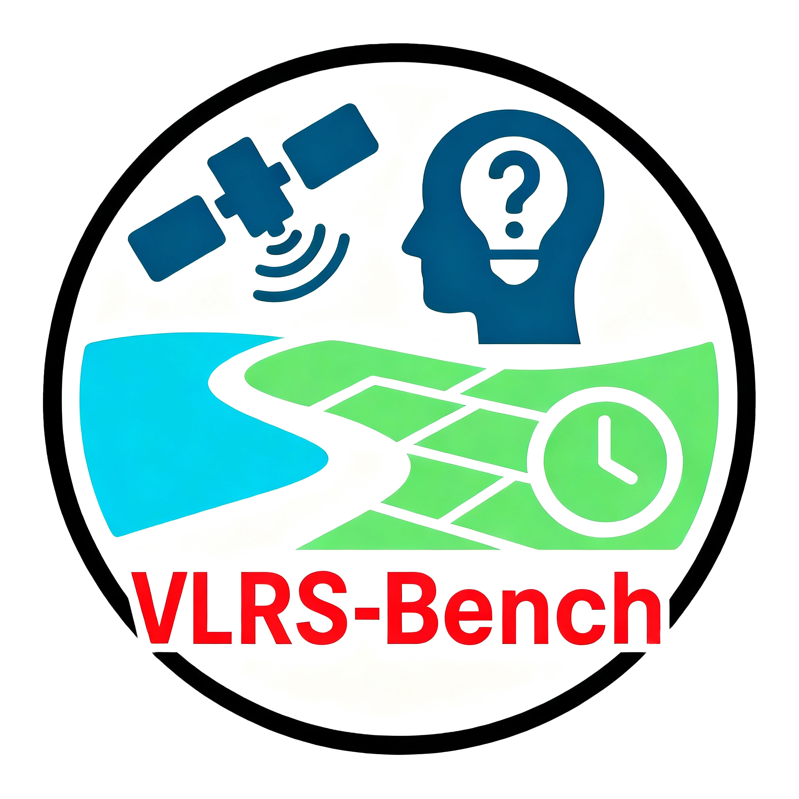

<div align="center">



# VLRS-Bench: A Vision-Language Reasoning Benchmark for Remote Sensing

[]([https://your-paper-link-here](https://arxiv.org/abs/2602.07045))
[](https://huggingface.co/datasets/your-link)
[](LICENSE)
[](https://www.python.org/)

**The first benchmark exclusively dedicated to complex geospatial reasoning: Cognition, Decision, and Prediction.**

[**Introduction**](#-introduction) | [**Hierarchy & Tasks**](#-reasoning-hierarchy) | [**Data Pipeline**](#%EF%B8%8F-dataset-construction) | [**Leaderboard**](#-leaderboard) | [**Get Started**](#-getting-started) | [**License**](#-license) | [**Citation**](#%EF%B8%8F-citation)

</div>

---

## 📖 Introduction

Recent advancements in Multimodal Large Language Models (MLLMs) have revolutionized visual understanding. However, existing Remote Sensing (RS) benchmarks remain heavily biased toward **perception tasks** (object recognition, scene classification). They fail to evaluate the *cognitive depth* required for real-world Earth Observation applications.

**VLRS-Bench** bridges this gap. It is a rigorous evaluation framework comprising **2,000 expert-verified reasoning QA** derived from **11 diverse datasets**. 

### 🚀 Key Features

* **🧠 Structured Reasoning:** Decomposed into **3** Dimensions, **6** Abilities, and **14** Fine-grained Tasks.
* **⏳ Temporal Depth:** Spans up to **8 temporal phases** for complex predictive reasoning.
* **🔥 High Complexity:** Average question length of **~71 words**, demanding multi-step logic rather than simple visual matching.

---
## 🧠 Reasoning Hierarchy

VLRS-Bench is structured around a scientifically grounded taxonomy inspired by cognitive neuroscience. We define 14 fine-grained tasks across three core dimensions.
<div align="center">

</div>

### 1. Cognition (Why is this?)
*Focuses on understanding the underlying causes and mechanisms of the observed scene.*

| Ability | Task | Description |
| :--- | :--- | :--- |
| **Spatial Cognitive (SC)** | **CR** (Causal Reasoning) | Identifying latent etiological factors driving phenomena (e.g., "Why is vegetation sparse here?"). |
| | **CFR** (Counterfactual Reasoning) | Simulating alternative scenarios (e.g., "If the river level rose 2m, would the bridge flood?"). |
| | **SIR** (Semantic Integration Reasoning) | Synthesizing visual primitives into regional semantics (e.g., classifying functional zones). |
| | **MIR** (Mechanistic Integration Reasoning) | Inferring implicit physical interactions/feedback loops between objects. |
| **Spatiotemporal (ST-C)** | **ST-CCR** (Spatiotemporal Causal-Chain Reasoning) | Inferring causal event chains across multiple time steps. |
| | **ST-CFR** (Spatiotemporal Counterfactual Reasoning) | Exploring trajectories by modifying past events in a sequence. |
| | **ST-ER** (Spatiotemporal Evolution Reasoning) | Capturing functional transformations of regions over time. |
| | **ST-CR** (Spatiotemporal Consistency Reasoning) | Verifying logical coherence of temporal changes. |

### 2. Decision (How to do?)
*Focuses on actionable planning based on visual evidence.*

| Ability | Task | Description |
| :--- | :--- | :--- |
| **Pre-event (Pre-D)** | **PR** (Planning Reasoning) | Formulating spatially optimized solutions (e.g., "Plan a rescue route avoiding flooded areas"). |
| **Post-event (Post-D)** | **ER** (Evaluation Reasoning) | Assessing feasibility and robustness of candidate plans. |

### 3. Prediction (What will happen?)
*Focuses on forecasting future states based on historical sequences.*

| Ability | Task | Description |
| :--- | :--- | :--- |
| **Object-level (OP)** | **ST-CS-PR** (Spatiotemporal Category-State Prediction Reasoning) | Predicting semantic state transitions of specific entities. |
| | **ST-M-PR** (Spatiotemporal Morphological Prediction Reasoning) | Extrapolating geometric evolution and shape changes. |
| **Scene-level (SP)** | **ST-SU-PR** (Spatiotemporal Scenario Uncertainty Prediction Reasoning) | Probabilistic forecasting of multiple potential future trajectories. |
| | **ST-SQ-PR** (Spatiotemporal Sequence Prediction Reasoning) | Predicting overall scene-level states via temporal dependencies. |

---

## 🛠️ Dataset Construction

<div align="center">

</div>

VLRS-Bench is constructed via a highly automated pipeline that integrates **RS-specific priors** (DSM, NIR, Expert Masks) to ensure geospatial realism.

Unlike traditional benchmarks that merely annotate visual objects, our pipeline integrates **multimodal priors (DSM, NIR)** and **expert knowledge** during the *data generation phase*. This allows us to create high-complexity reasoning QA pairs that challenge standard RGB models to infer hidden attributes (e.g., building height, vegetation health) from visual cues alone.


### 🔬 Detailed Steps

#### 1. Prior Injection & Multi-Source Fusion

We do not rely solely on RGB images. We aggregate multi-source data to establish a "God's Eye View" of the scene context:

* **RGB Imagery:** The base visual input (from FAIR1M, xView2, etc.).
* **DSM (Digital Surface Model):** Provides absolute **height information** and **3D geometry**, essential for reasoning about building density and terrain.
* **NIR (Near-Infrared):** Provides spectral indices (e.g., NDVI) to determine **vegetation health**, water content, and material properties invisible to the naked eye.

To allow the LLM to "see" the image accurately without visual encoders, we developed the **Mask Info Palette**.

* **Segmentation:** We utilize **SAMRS** (Segment Anything for Remote Sensing) to convert bounding boxes into precise pixel-level masks.
* **Palette Mapping:** We map visual signals to semantic text descriptions.
> *Example:* A region with `High DSM` + `Low NIR` + `Rectangular Mask`  **"High-density concrete building."**


#### 3. Task-Specific Instruction Generation

Using the *Mask Info Palette* as the "Ground Truth," we prompt advanced LLMs (e.g., GPT-5/4o) to generate questions.

* **The Challenge:** The generator sees the priors (Height/NIR), but the question is phrased so that the **student model (Evaluation target) only sees the RGB**.
* **Reasoning Gap:** The model must use logical reasoning (e.g., "shadow length implies height," "texture implies material") to answer, rather than simple recognition.

#### 4. Rigorous Tri-Stage Verification

To ensure the benchmark is error-free and logically sound, every QA pair undergoes a strict filtration process:

| Stage | Method | Criteria | Pass Rate |
| --- | --- | --- | --- |
| **I. Auto-Filter** | Rule-based | Removes QAs with <15 words, extreme ambiguity, or format errors. | ~85% |
| **II. Model Check** | Multi-Agent | A "Proposer" model generates answers; an "Evaluator" model verifies if the logic path is consistent. | ~64% |
| **III. Expert Review** | **PhD Humans** | Remote Sensing experts verify the *geospatial correctness* (e.g., is the flood prediction physically possible?). | **~48%** |

> 💡 **Technical Note:** While we use DSM and NIR to *generate* the ground truth, **VLRS-Bench is an RGB-only benchmark during inference**. This simulates real-world constraints where auxiliary data is often unavailable.


---

## 🏆 Leaderboard

Evaluation of state-of-the-art MLLMs on VLRS-Bench (Zero-shot setting).  
*Note: Scores represent accuracy/weighted scores. **X** indicates the model does not support multi-image inputs required for that task.*

### Main Results (Table 2)

| Models | **Cognition** <br> CR / CFR / SIR / MIR | **Cognition (ST)** <br> ST-CFR / ST-CCR / ST-ER / ST-CR | **Decision** <br> ER / PR | **Prediction** <br> CS-PR / M-PR / SU-PR / SQ-PR |
| :--- | :---: | :---: | :---: | :---: |
| **General MLLMs** | | | | |
| **GPT-5-chat** | 0.424 / 0.400 / 0.472 / 0.316 | 0.276 / 0.352 / 0.380 / 0.368 | 0.388 / 0.388 | 0.334 / 0.286 / 0.388 / 0.416 |
| **GPT-4o** (2024-11) | 0.376 / 0.432 / 0.420 / 0.332 | 0.360 / 0.352 / 0.400 / 0.364 | 0.334 / 0.286 | 0.276 / 0.352 / 0.280 / 0.284 |
| **GPT-4o-mini** | 0.428 / 0.416 / 0.428 / 0.328 | 0.400 / 0.356 / 0.352 / 0.336 | 0.248 / 0.304 | 0.424 / 0.372 / 0.280 / 0.304 |
| **Gemini-2.5-flash**| 0.200 / 0.188 / 0.264 / 0.240 | 0.188 / 0.160 / 0.116 / 0.160 | 0.232 / 0.240 | 0.164 / 0.168 / 0.116 / 0.152 |
| **Claude-3.5-haiku**| 0.308 / 0.316 / 0.304 / 0.360 | 0.192 / 0.208 / 0.232 / 0.200 | 0.372 / 0.370 | 0.208 / 0.224 / 0.248 / 0.168 |
| **Qwen2.5-VL-72B** | 0.216 / 0.300 / 0.296 / 0.392 | 0.316 / 0.240 / 0.216 / 0.204 | 0.370 / 0.402 | 0.172 / 0.180 / 0.204 / 0.188 |
| **Qwen3-VL-32B** | 0.372 / 0.416 / 0.476 / 0.316 | 0.408 / 0.428 / 0.388 / 0.392 | 0.416 / 0.364 | 0.388 / 0.456 / 0.336 / 0.372 |
| **RS MLLMs** | | | | |
| **GeoChat** | 0.280 / 0.332 / 0.360 / 0.308 | X / X / X / X | 0.356 / 0.352 | X / X / X / X |
| **ScoreRS w/ SFT** | 0.403 / 0.367 / 0.421 / 0.345 | 0.294 / 0.310 / 0.288 / 0.284 | 0.419 / 0.382 | 0.341 / 0.320 / 0.313 / 0.295 |
| **ScoreRS w/ RL** | 0.313 / 0.338 / 0.382 / 0.295 | 0.399 / 0.335 / 0.367 / 0.392 | 0.371 / 0.409 | 0.338 / 0.313 / 0.382 / 0.342 |

### Benchmark Comparison (Table 1)

VLRS-Bench significantly exceeds existing benchmarks in terms of RS-specific priors and reasoning complexity.

| Benchmark | Data Source | Avg. QA Len | Type | Reason. Dim | Temporals | RS Priors |
| :--- | :--- | :--- | :--- | :--- | :--- | :--- |
| **General Domain** | | | | | | |
| MMBench | 10 Public Datasets | X | MCQ | 8 | X | X |
| MMStar | 6 Public Benchmarks | X | MCQ | 6 | X | X |
| **Remote Sensing** | | | | | | |
| RSVQA | HR & LR Datasets | X | FF | X | X | X |
| GeoChat | SAMRS, LRBEN | X | FF | X | X | BBox, Mask |
| EarthVQA | LoveDA Dataset | X | FF | 3 | X | Mask |
| XLRS-Bench | 6 Public Datasets | X | MCQ, TF | 6 | 2 | BBox |
| **VLRS-Bench** | **11 Public Datasets** | **70.96** | **MCQ, FF, TF** | **14** | **8** | **BBox, Mask, DSM, NIR** |

---


## 🚀 Getting Started

### Installation

```bash
git clone [https://github.com/thislzm/VLRS-Bench.git](https://github.com/thislzm/VLRS-Bench.git)
cd VLRS-Bench
```

### Data Preparation

Download the dataset from BaiduYun and organize it as follows:

```
data/
├── images/
└── vlrs_bench.json

```


---

## 📜 License

This dataset is released under the **Creative Commons Attribution-NonCommercial-ShareAlike 4.0 International License**.
The images sourced from public datasets (DOTA, LoveDA, etc.) adhere to their original licenses.

---

## 🖊️ Citation

If you find **VLRS-Bench** useful for your research, please cite our paper:

```bibtex
@article{vlrsbench,
      title={VLRS-Bench: A Vision-Language Reasoning Benchmark for Remote Sensing}, 
      author={Zhiming Luo and Di Wang and Haonan Guo and Jing Zhang and Bo Du},
      year={2026},
      eprint={2602.07045},
      archivePrefix={arXiv},
      primaryClass={cs.CV},
      url={https://arxiv.org/abs/2602.07045}, 
}

```

---

<div align="center">
<p>Maintained by the VLRS-Bench Team</p>
</div>

```
